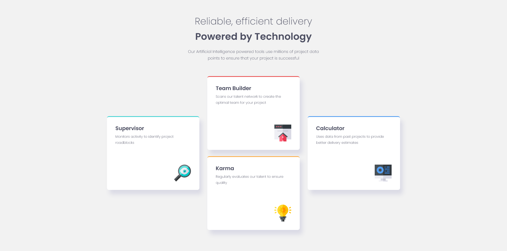

# Frontend Mentor - Four card feature section solution

This is a solution to the [Four card feature section challenge on Frontend Mentor](https://www.frontendmentor.io/challenges/four-card-feature-section-weK1eFYK). Frontend Mentor challenges help you improve your coding skills by building realistic projects.

## Table of contents

- [Overview](#overview)
  - [The challenge](#the-challenge)
  - [Screenshot](#screenshot)
  - [Links](#links)
  - [Built with](#built-with)
  - [Useful resources](#useful-resources)
- [Author](#author)

## Overview

### The challenge

Users should be able to:

- View the optimal layout for the site depending on their device's screen size

### Screenshot

### Links

- Solution URL: [Link](https://olaide-hok.github.io/feature-section/)

### Built with

- Semantic HTML5 markup
- CSS custom properties
- CSS Grid
- Mobile-first workflow
- [Sass](https://sass-lang.com/) - Sass is the most mature, stable, and powerful professional grade CSS extension.

### Useful resources

- [CSS Grid](https://developer.mozilla.org/en-US/docs/Web/CSS/grid) - This helped me for CSS Grid. I really liked this resource and will use it going forward.
- [Google Fonts](https://fonts.google.com/) - This helped me add the Poppins fonts.

## Author

- Website - [Habeeb Kareem](https://habeeb-dev.netlify.app)
- Frontend Mentor - [@olaide-hok](https://www.frontendmentor.io/profile/olaide-hok)
